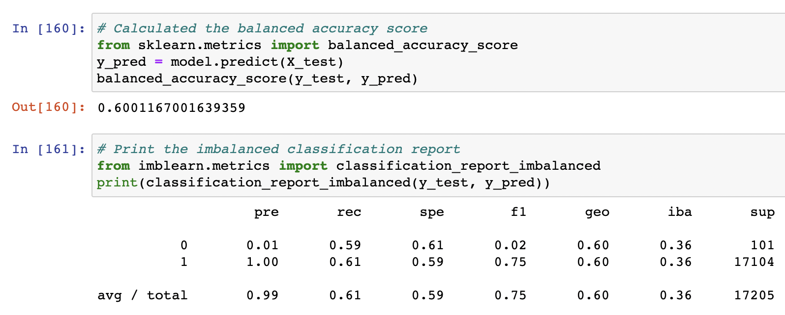
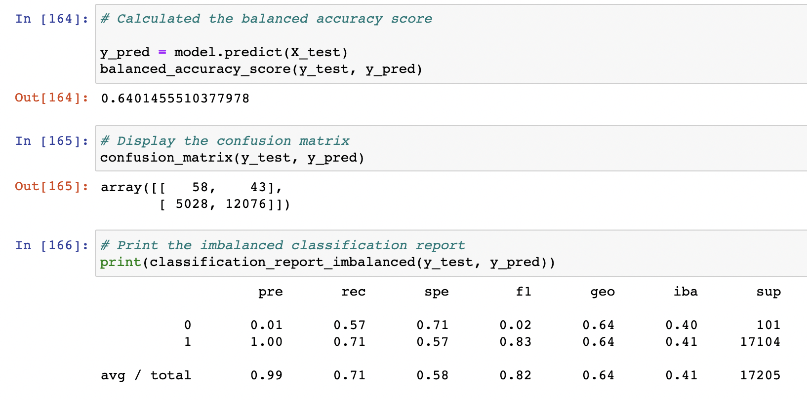
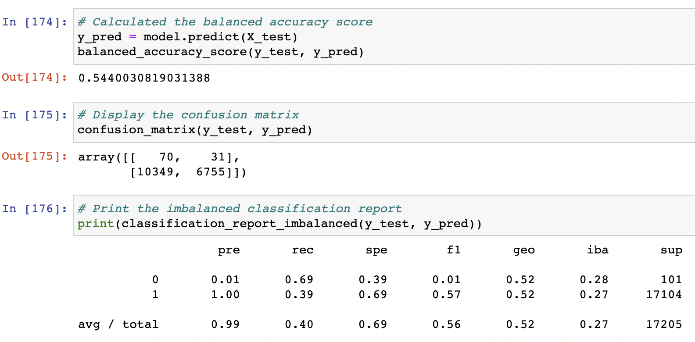
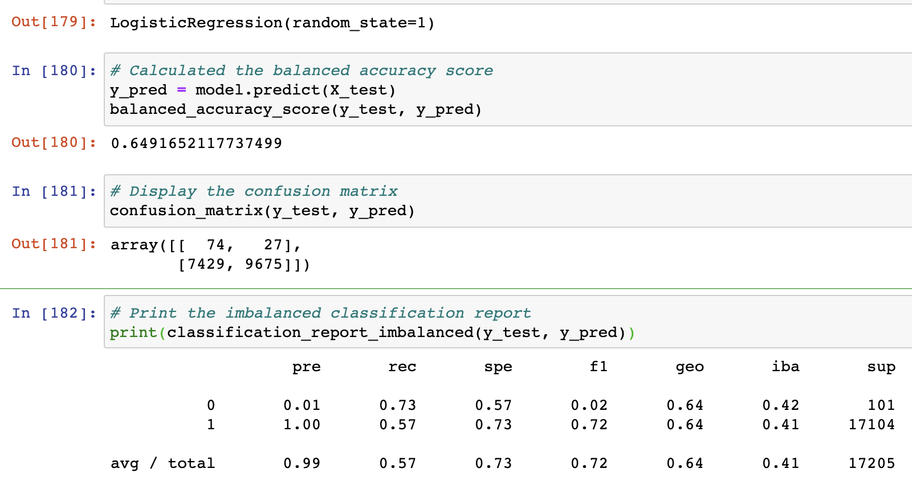
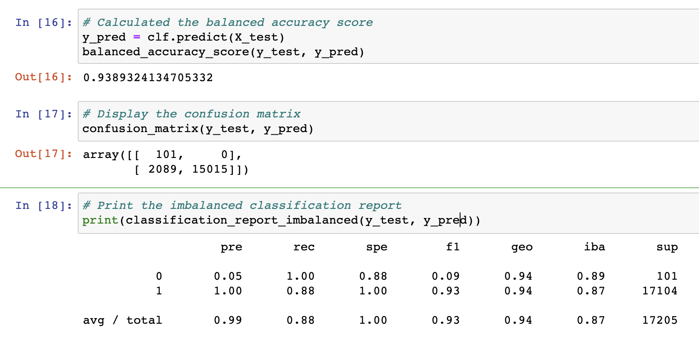
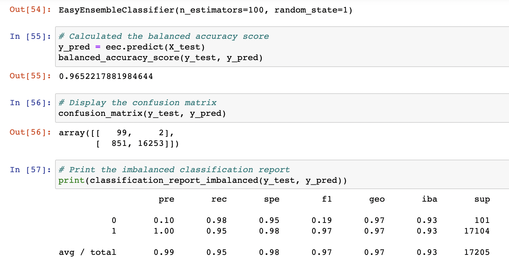

# Credit Risk Analysis
The purpose of this analysis was to utilize multiple supervised machine learning models to find a solution to predicting credit risk based on a credit card dataset. Given that credit risk is an inherently unbalanced classification problem, as good loans easily outnumber risky loans, employing different techniques to train and evaluate models with unbalanced classes was the best approach to this problem. The imbalanced-learn and scikit-learn libraries were used to build and evaluate models using resampling. Below, you'll see the results of the machine learning models.

## Results 

### Naive Random Oversampling Model
- The accuracy of the naive random oversamplig model was .60
- The average precision score of this model was 0.99 (however, the precision score for prediciting high risk was only 0.01 while the precision score for low risk was 1.0)
- The average recall score of this model was 0.61 (the recall score for predicting high risk was 0.59 and the recall score for low risk was 0.61)

### SMOTE Oversampling Model
- The accuracy of the SMOTE oversampling model was 0.64
- THe average precision score of this model was 0.99 (however, the precision score for predicting high risk was only 0.01 while the precision score for low risk was 1.0)
- The average recall score of this model was 0.71 (the recall score for predicting high risk was 0.57 and the recall score for low risk was 0.71)

### Undersampling Model
- The accuracy score of the undersampling model was 0.54
- The average precision score of this model was 0.99 (however, the precision score for predicting high risk was only 0.01 while the precision score for low risk was 1.0)
- The average recall score of this model was 0.40 (the recall score for predicting high risk was 0.69 and the recall score for low risk was 0.39)

### SMOTEENN Combination (Over and Under) Sampling Model
- The accuracy score of the SMOTEENN model was 0.65
- The average precision score of this model was 0.99 (however, the precision score for predicting high risk was only 0.01 while the precision score for low risk was 1.0)
- The average recall score of this model was 0.57 (the recall score for predicting high risk was 0.57 and the recall score for low risk was 0.73)

### Balanced Random Forest Classifier Model
- The accuracy score of the balanced random forest model was 0.94
- The average precision score of this model was 0.99 (however, the precision score for predicting high risk was only 0.05 while the precision score for low risk was 1.0)
- The average recall score of this model was 0.88 (the recall score for predicting high risk was 1.0 and the recall score for low risk was 0.88)

### Easy Ensemble AdaBoost Classifier Model
- The accuracy score of this easy ensemble model was 0.97
- The average precision score of this model was 0.99 (however, the precision score for predicting high risk was only 0.1 while the precision score for low risk was 1.0)
- The average recall score of this model was 0.95 (the recall score for predicting high risk was 0.95 and the recall score for low risk was 0.98)

## Summary 
Of the six models tested, the model I would most recommend based on the results is the Easy Ensemble AdaBoost Classifier Model. The reason for this recommendation is based on the high level of accuracy achieved for this model compared to the other models. Take the Undersampling model, for instance, which had an accuracy score barely better than random chance. The Easy Ensemble model performed much better in comparison. Additionally, the Easy Ensemble model has the lowest discrepancy among the tested models between the recall and precision scores for predicting high risk and low risk outcomes. The average scores for precision and recall are both above 0.95, the highest of all the models.

One point of consideration is that none of the models had high precision for predicting high risk outcomes, and the discrepancy between precision scores for high and low risk outcomes was very high for all of the models. Despite utilizing techniques to over and undersample the data to produce consistent sample sizes for both outcomes, this did not necessarily help create a model with high level accuracy for predicting high risk outcomes, which was the main purpose of this exercise. 

Given this, and whle the Easy Ensemble model was the best option of the models used, I would recommend further testing be done to find a better prediction model for this data set. Using a larger number of estimators with the Ensemble model options would be the first step I would take toward trying these models again with different paramaters before moving on to more complex machine learning models.
